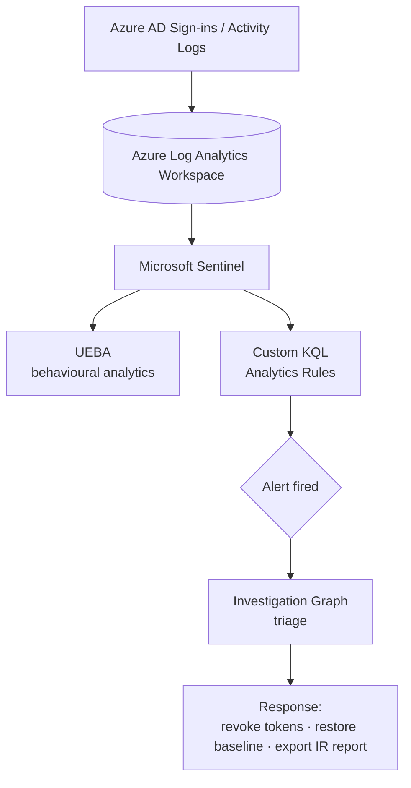

# Microsoft Sentinel SIEM & SOC Lab — Tor Attack Simulation

> A personal home-lab where I built a working SOC on Microsoft Sentinel, wrote custom **KQL detection rules mapped to MITRE ATT&CK**, then ran a full detection-to-response cycle against a simulated attack.


---

## Overview

The goal of this lab was to experience the **full SOC workflow end to end** — not just "turn on a SIEM," but ingest logs, author detections, generate a real alert, triage it, and remediate. I built the environment on Microsoft Sentinel over an Azure Log Analytics Workspace, enabled UEBA, and simulated an attacker signing in through the **Tor network** and destroying configuration, then detected and responded to it.

> ⚠️ **Ethics & scope:** All activity was performed against my own isolated lab tenant/resources. The "attack" is a controlled simulation for detection engineering practice.

---

## Architecture



---

## Detections Authored

I wrote custom **KQL analytics rules** for two attacker behaviours and mapped each to MITRE ATT&CK:

| Detection | MITRE Technique |
|---|---|
| Sign-in from a Tor exit node | **T1090.003** — Proxy: Multi-hop Proxy |
| Unauthorized configuration / resource deletion | **T1485** — Data Destruction |

**Tor exit-node sign-in (T1090.003):**
```kql
// Flags interactive sign-ins originating from known Tor / anonymising infrastructure
SigninLogs
| where ResultType == 0                       // successful sign-ins
| extend ip = tostring(IPAddress)
| where isnotempty(ip)
// join against Tor exit-node IP watchlist:
| join kind=inner (
    _GetWatchlist('TorExitNodes')
    | project ip = tostring(SearchKey)
) on ip
| project TimeGenerated, UserPrincipalName, ip, Location, AppDisplayName
| order by TimeGenerated desc
```

**Unauthorized config deletion (T1485):**
```kql
// Surfaces delete operations across Azure resources for review
AzureActivity
| where OperationNameValue has "delete"
| where ActivityStatusValue == "Success"
| project TimeGenerated, Caller, OperationNameValue, ResourceGroup, _ResourceId, CallerIpAddress
| order by TimeGenerated desc
```

---

## Incident Response Walkthrough

1. **Simulated the attack** — signed in via Tor and performed an unauthorized configuration deletion.
2. **Alerts fired** from the custom analytics rules; UEBA flagged the anomalous behaviour.
3. **Triaged in the Investigation Graph** — pivoted across the user, IP, and affected resources to scope the incident.
4. **Remediated** — revoked the compromised session tokens, restored the deleted configuration to baseline, and **exported a formal SOC incident report.**

---

## Tools & Technology

`Microsoft Sentinel` · `Azure Log Analytics Workspace` · `KQL (Kusto Query Language)` · `UEBA` · `MITRE ATT&CK` · `Investigation Graph` · `Incident Response`

---

## What I Learned

- Writing precise KQL detections that catch a technique without drowning the analyst in false positives.
- Mapping detections to MITRE ATT&CK so alerts carry context, not just noise.
- The muscle memory of triage → scope → contain → remediate → document.

---

## About Me

**Kuldeep Mishra** — aspiring SOC Analyst.
📧 km828591@gmail.com · 🔗 [LinkedIn](https://www.linkedin.com/in/kuldeep-mishra-soc/) · 💻 [GitHub](https://github.com/Kuldeep-Mishra00)
