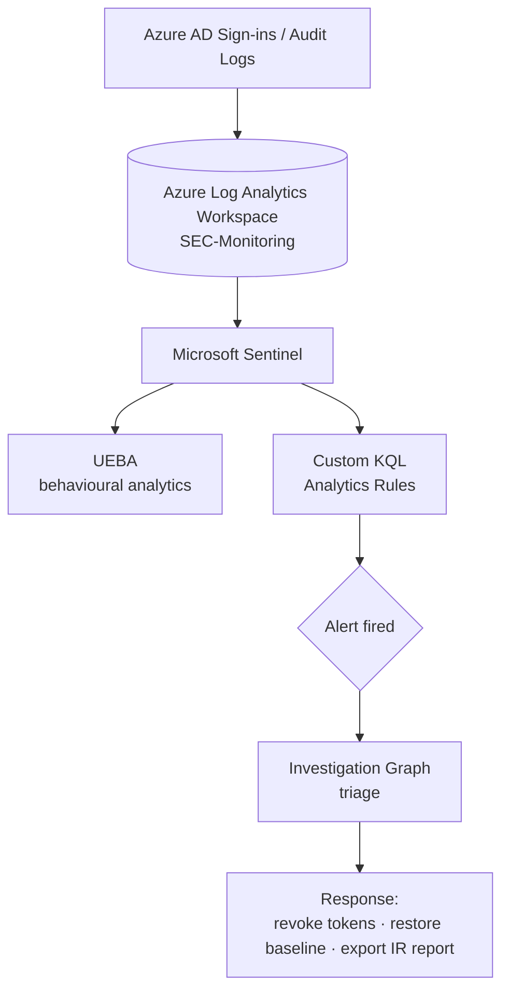

# Microsoft Sentinel SIEM & SOC Lab — Tor Attack Simulation

> A personal home-lab where I built a working SOC on Microsoft Sentinel, wrote custom **KQL detection rules mapped to MITRE ATT&CK**, then ran a full detection-to-response cycle against a simulated attack.


---

## Overview

The goal of this lab was to experience the **full SOC workflow end to end** — not just "turn on a SIEM," but ingest logs, author detections, generate a real alert, triage it, and remediate. I provisioned Microsoft Sentinel over an Azure Log Analytics Workspace (**SEC-Monitoring**), piped SigninLogs and AuditLogs into the SIEM pipeline, enabled UEBA, and simulated an attacker signing in through the **Tor network** and destroying configuration — then detected and responded to it.

> ⚠️ **Ethics & scope:** All activity was performed against my own isolated lab tenant/resources. The "attack" is a controlled simulation for detection engineering practice.

---

## Architecture



---

## Detections Authored

I wrote custom **KQL analytics rules** for two attacker behaviours, both firing as high-severity incidents:

**Rule 1 — Tor exit-node sign-in detection:**
```kql
let TorNodes = (_GetWatchlist('Tor-IP-Address') | project TorIP = IpAddress);
SigninLogs
| where IPAddress in (TorNodes)
| where ResultType != 50126
| project
    TimeGenerated,
    Location,
    IPAddress,
    UserDisplayName,
    UserPrincipalName,
    UserId,
    LocationDetails,
    RiskState,
    RiskLevelDuringSignIn,
    AuthenticationRequirement,
    ClientAppUsed,
    ConditionalAccessAudiences
```

**Rule 2 — Unauthorized configuration deletion detection:**
```kql
AuditLogs
| where OperationName has_any ("Delete", "Remove")
| where Result == "success"
| where InitiatedBy.user.userPrincipalName != ""
| project
    TimeGenerated,
    OperationName,
    Result,
    InitiatedBy,
    TargetResources,
    AdditionalDetails
```

---

## Incident Response Walkthrough

1. **Simulated the attack** — connected through the Tor Browser via a foreign exit node, authenticated with compromised test-user credentials, and executed unauthorized deletion of directory/resource configurations.
2. **Alerts fired** — the custom analytics rules triggered high-severity incidents; UEBA flagged the anomalous behaviour.
3. **Triaged in the Investigation Graph** — visually mapped the attack chain and blast radius, linking the compromised test user, the malicious Tor exit-node IP, and the tampered configuration assets.
4. **Remediated** — revoked the compromised account's active sessions and refresh tokens via Microsoft Entra ID, restored secure baseline configurations, and **exported an official SOC Incident Report PDF** for audit compliance.

---

## MITRE ATT&CK Mapping

| Tactic | Technique | ID |
|---|---|---|
| Impact | Data Destruction | **T1485** |
| Command & Control | Ingress Tool Transfer | **T1105** |
| Defense Evasion | Proxy: Multi-hop Proxy (Tor) | **T1090.003** |

---

## Repository Structure

```
├── README.md
├── detection-rules/
│   └── custom_detection_rule.kql
├── watchlists/
│   └── high_risk_users.csv
└── screenshots/
    ├── sentinel_dashboard.png
    ├── incident_graph.png
    └── remediation_success.pdf
```

> 📸 Screenshots and the final remediation PDF report are located in the `/screenshots` directory.

---

## Tools & Technology

`Microsoft Sentinel` · `Azure Log Analytics Workspace (SEC-Monitoring)` · `Microsoft Entra ID` · `KQL (Kusto Query Language)` · `UEBA` · `MITRE ATT&CK` · `Investigation Graph` · `Incident Response` · `Tor (attack simulation)`

---

## What I Learned

- Writing precise KQL detections that catch a technique without drowning the analyst in false positives.
- Mapping detections to MITRE ATT&CK so alerts carry context, not just noise.
- The muscle memory of triage → scope → contain → remediate → document.

---

## About Me

**Kuldeep Mishra** — aspiring SOC Analyst.
📧 km828591@gmail.com · 🔗 [LinkedIn](https://www.linkedin.com/in/kuldeep-mishra-soc/) · 💻 [GitHub](https://github.com/Kuldeep-Mishra00)
